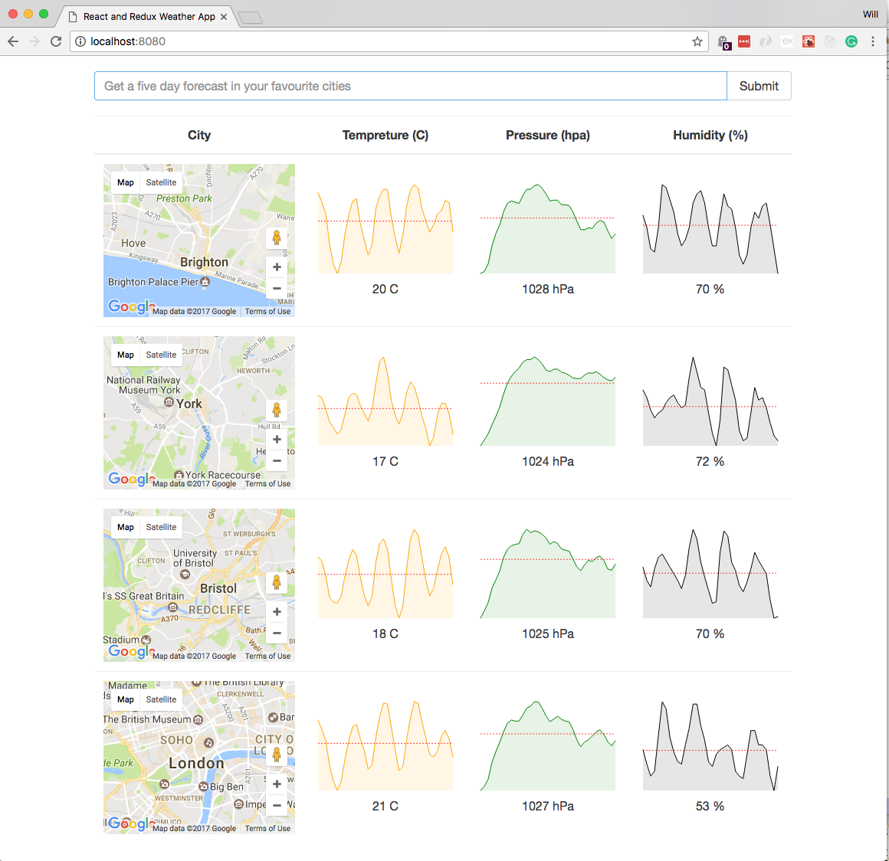

# React with Redux Weather Application

A project from one of the tutorials I have done on Udemy.

Using:

* React
* Redux
* Axios
* Lodash
* React Sparklines
* Redux Promise



To test out this project yourself. Clone this repository, install the packages and start the local development server.

```
npm install
npm start
```

Note: You will need an API key for Open Weather Map set as an environment variable named  OPENWEATHERMAPAPI. 